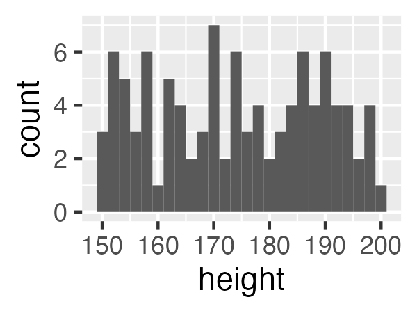
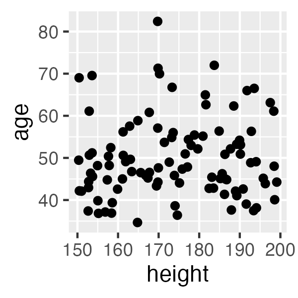
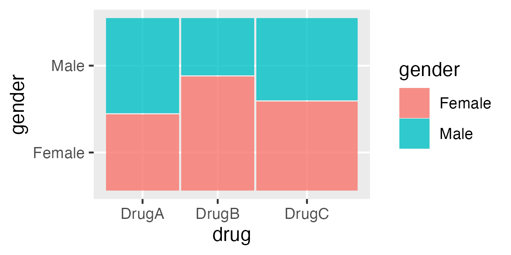

# Introduction to Exploratory Data Analysis (EDA) with R

Welcome to the "Introduction to Exploratory Data Analysis (EDA) with R" workshop! This one-day course is designed for graduate-level learners without a computational background. Our goal is to equip you with the foundational skills needed to summarize, visualize, and interpret data effectively.

## What is EDA?

Exploratory Data Analysis (EDA) is an essential first step in any data analysis workflow. It involves summarizing the main characteristics of a dataset, often using visual methods. EDA helps you understand the data, uncover patterns, spot anomalies, and test hypotheses.

## Types of Data

Understanding the types of data you are working with is crucial for effective analysis. Data can generally be categorized into two main types:

### Numerical Data

Numerical data represents quantities and can be further divided into:  
- **Continuous Data**: Data that can take any value within a range (e.g., height, weight).  
- **Discrete Data**: Data that can only take specific values (e.g., number of students in a class).

### Categorical Data

Categorical data represents characteristics and can be divided into:  
- **Nominal Data**: Data with categories that do not have a natural order (e.g., gender, color).  
- **Ordinal Data**: Data with categories that have a natural order (e.g., rankings, satisfaction levels).

## Primary Visualizations and Statistical Summaries

Different types of data require different visualization techniques. 

When deciding how to visualize data, refer to:  
- [Data-to-Viz](https://www.data-to-viz.com/): Provides guidance on choosing the right chart for specific data types and objectives.  
- [R Graph Gallery](https://www.r-graph-gallery.com/): Offers a large collection of R graphical examples, complete with code snippets.

The Data-to-Viz and R Graph Gallery websites provide extensive collections of visualization examples. Each example is accompanied by an explanation of the relevant theory and example code in R. These resources can help you choose the most appropriate visualization for your data.

### Introduction to `tidyverse`

The `tidyverse` is a collection of R packages designed for data science. It includes packages like `ggplot2` for data visualization, `dplyr` for data manipulation, and `tidyr` for data tidying. Throughout this workshop, we will use functions from the `tidyverse` to perform EDA.

To install and load the `tidyverse`, use the following commands:
```{r}
install.packages("tidyverse")
library(tidyverse)
```

<details>
<summary>Define a Sample Dataset</summary>

Here is an example of how to define a sample dataset with two categorical columns and three numeric columns (one from a uniform distribution, one from a normal distribution, and one from a binomial distribution):

```{r}
# Define a sample dataset
set.seed(123)
data <- data.frame(
  drug = sample(c("DrugA", "DrugB", "DrugC"), 100, replace = TRUE),
  gender = sample(c("Male", "Female"), 100, replace = TRUE),
  height = runif(100, min = 150, max = 200),  # Uniform distribution
  age = rnorm(100, mean = 50, sd = 10),      # Normal distribution
  response = rbinom(100, size = 1, prob = 0.5) # Binomial distribution
)

# Display the first few rows of the dataset
head(data)
```
</details>

### Numerical Data

For numerical data, the following techniques are commonly used:

- **Descriptive Statistics**: Calculate measures such as mean, median, standard deviation, and range to summarize the data.
``` {r}
# Calculate summary statistics
summary(data$height)
>    Min. 1st Qu.  Median    Mean 3rd Qu.    Max. 
>   150.3   161.2   173.7   174.0   187.0   199.1 
data %>% summarise(mean = mean(height), median = median(height), sd = sd(height))
>       mean   median       sd
> 1 174.0325 173.7355 14.75736
```

- **Histograms**: Visualize the distribution of the data by showing the frequency of data points within specified ranges.
```{r}
# Create a histogram
ggplot(data, aes(x = height)) + geom_histogram(binwidth = 2)
```
 

- **Boxplots**: Display the distribution of the data based on a five-number summary (minimum, first quartile, median, third quartile, and maximum) and identify outliers.
```{r}
# Create a boxplot
ggplot(data, aes(y = height)) + geom_boxplot()
```

- **Scatterplots**: Plot pairs of numerical data to identify relationships or correlations between variables.
```{r}
# Create a scatterplot
ggplot(data, aes(x = height, y = age)) + geom_point()
```


- **Line Graphs**: Show trends over time or ordered categories.
```{r}
# Create a line graph
ggplot(data, aes(x = 1:100, y = height)) + geom_line()
```

### Categorical Data

For categorical data, the following techniques are commonly used:

- **Frequency Tables**: Summarize the data by counting the occurrences of each category.
```{r}
# Create a frequency table
table(data$drug)
> DrugA DrugB DrugC 
>    33    32    35 
data %>% count(drug)
>    drug  n
> 1 DrugA 33
> 2 DrugB 32
> 3 DrugC 35
```

- **Bar Charts**: Visualize the frequency or proportion of categories using bars.
```{r}
# Create a bar chart
ggplot(data, aes(x = drug)) + geom_bar()
```

- **Mosaic Plots**: Show the relationship between two or more categorical variables by dividing a rectangle into proportional areas.
```{r}
# Create a mosaic plot
install.packages("ggmosaic")
library(ggmosaic)
ggplot(data) + 
  geom_mosaic(aes(weight = response, x = product(drug), fill = gender))
```


## Concept Test

Let's test your understanding of the concepts covered so far. Try to answer the following questions:

1. What is the difference between continuous and discrete numerical data?
<details>
<summary>Answer</summary>
Continuous data can take any value within a range (e.g., height, weight), while discrete data can only take specific values (e.g., number of students in a class).
</details>

2. What are the main differences between nominal and ordinal categorical data?
<details>
<summary>Answer</summary>
Nominal data has categories without a natural order (e.g., gender, color), while ordinal data has categories with a natural order (e.g., rankings, satisfaction levels).
</details>

3. Which R package from the `tidyverse` is primarily used for data visualization?
<details>
<summary>Answer</summary>
The `ggplot2` package is primarily used for data visualization in the `tidyverse`.
</details>

## Task

Visit the [Data-to-Viz](https://www.data-to-viz.com/) website and find the recommended visualizations for a dataset containing a numerical and a categorical data, there are many obsevations per category. Which one you would choose. Can you find the R code to create that visualization (*hint: [R Graph Gallery](https://www.r-graph-gallery.com/)*)?

## Conclusion

In this chapter, we introduced the basics of Exploratory Data Analysis (EDA) and discussed different types of data and their visualization techniques. We also provided R code examples using the `tidyverse` package to help you get started with EDA. In the next chapters, we will dive deeper into more advanced techniques and real-world applications of EDA.
